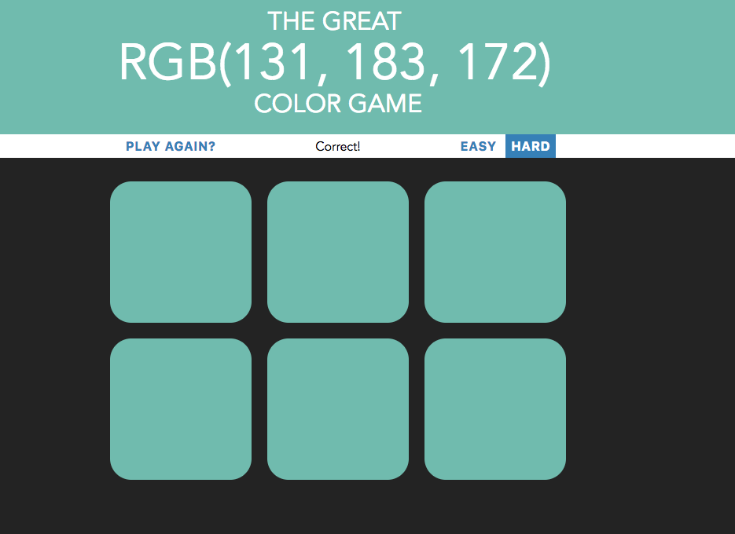

# JavaScript/CSS 

> Contains useful JS and CSS code for reuse and reference purposes. The ColorGame and ToDo List are built on vanilla JS and Html/CSS. Collapsible Sidebar uses Bootstrap-4, Font-Awesome-5 and CSS. It can be directly used for creating a sidebar and necessary adjustments can be made based on the need.

## Table of Contents

[Color Game](#color-game-preview) | [ToDo List](#todo-list-preview) | [Collapsible Sidebar](#collapsible-sidebar-preview)

### Color Game Preview

### ToDo List Preview

### Collapsible Sidebar Preview

## License
Misc. Documentation

 This repository is licensed under a <a rel="license" href="http://creativecommons.org/licenses/by-nc-sa/4.0/">Creative Commons Attribution-NonCommercial-ShareAlike 4.0 International License</a>.
